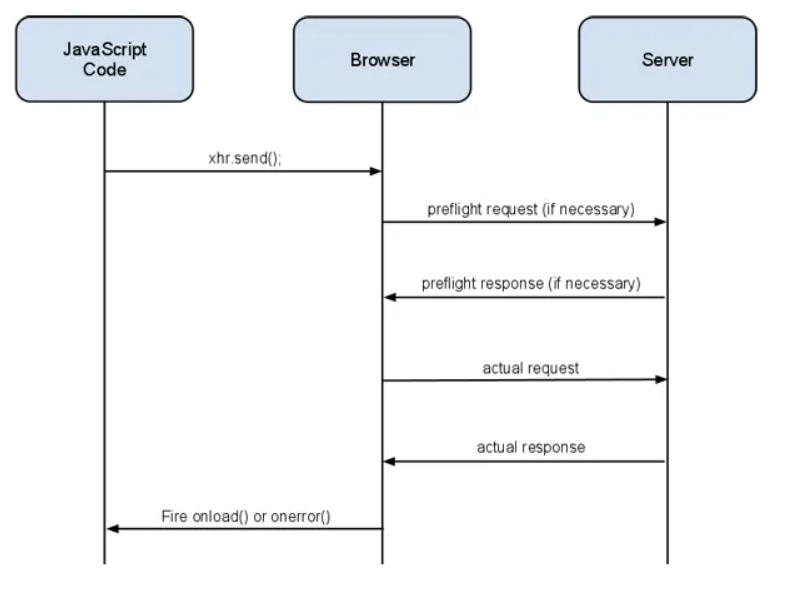
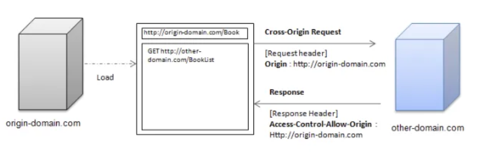
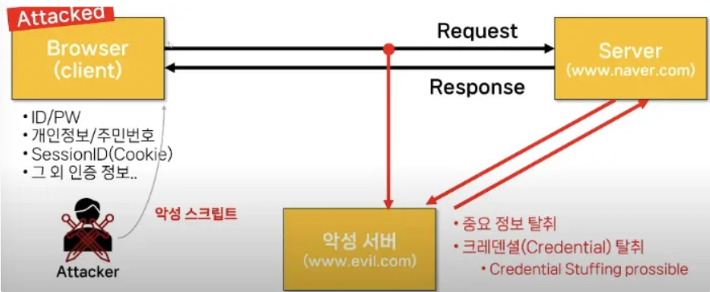

## 🦥 본문

## Motivation

### Background

- 보안 애플리케이션을 위해 flow 별 분포 특징에 대한 수요
- In-network computing : 스위치 내의 data plane 리소스를 활용해 실시간 flow 특징을 측정

### Existing Limitation

**단일 지점 측정** : 단일 스위치의 data plane 리소스의 제약. 

- 기존 방식
    - FlowLens : 패킷 크기 분포 수집.
        - 하드웨어 제약에 의해 분포 데이터를 양자화하여 관리.
        - ML과 결합
        - 플로우 측정 시 사용되는 해시 테이블 구조 자체가 스위치의 부족한 메모리 공간에 의해 장벽이 생김
    - Netwarden : 플로우 별 분포 데이터 사용.
        - 메모리 무작위 공유를 적용한 스케치 접근 방식
        - 포화 문제로 오차 범위 보장이 사라짐

**중앙 집중적 측정** 

- control loop의 느린 반응으로 동적 트래픽 변화에 적응이 느림
    - control loop : 데이터 수집 → 보고 → 판단 → 명령 전달
    - 기존 방식
        - CSAMP와 NSPA
            - 느린 반응으로 네트워크 트래픽의 동적 변화에 대한 적응이 느림.
            - 수명이 짧은 마이스 플로우가 control loop를 통해 메모리 리소스 간헐적으로 낭비
        - CFS : 각 스위치는 로컬 시야를 바탕으로 현장 의사 결정 수행
            - 중복된 측정 작업으로 메모리 낭비 문제
- 중복 측정
- 데이터 파편화로 인한 모델 오염 : 플로우의 특징들이 쪼개져 측정되어 정보 손실. 탐지 정확도가 떨어짐.
    
    → 중앙 서버로 Data Migration 필요
    
    - 데이터 가용성 측면
        
        
        
        **Cloud Computing based Defense** : 경계 경로 프로토콜(BGF)나 DNS를 이용하여 네트워크 트래픽을  scrubbing center로 유도하여 데이터 수집.
        
        - 공격 대상이 네트워크 링크나 인터넷 교환 지점(IXP)와 같은 중간 인프라의 경우에 데이터 수집 불가.
        
        **ISP-level Defense** : ISP는 인프라 계층에서 가장 강력한 데이터 가용성을 보유
        
        - 하지만 노스바운드 대역폭은 데이터 이동보다 네트워크 운영 기능이 우선적
        - 노스 바운드 방향으로의 지속적인 데이터 이동은 리소스에 부담
- 단순 카운트 기반의 볼륨 측정의 정보량 부족 : 정교한 패턴 분석을 위한 ML/DL 기반 보안 모델에는 정보량이 부족함
    - 단순 카운트 기반의 볼륨 측정 : Link Flooding Attack(LFA)를 막기 위한 방어책

## ISDC

분산된 스위치의 네트워크 운영체제(NOS)에 상주하는 미들웨어. 

### Framework

Flow Identifier (FI)와 Feature Meter (FM)이 각 스위치의 패킷 처리 파이프라인(ASIC)에 있음 

ISDC storage는 NOS에 통합. data plane과 스토리지 간의 통신은 PCIe를 활용. 

분산 스토리지가 data layer를 형성하고 노스바운드 애플리케이션에 서비스 제공

**동작 흐름**

1. 플로우 식별 : 플로우 크기에 따라 우선 순위를 제공하기 위해 플로우 크기 예측 알고리즘 FI로 예측
2. 피처 측정 : feature measurement(FM)에서 해시 테이블을 사용하여 특징 추출
3. task migration : 해시 테이블 충돌이 발생한 경우 피처 측정을 놓치지 않기 위해 다음 스위치로 작업이 인계하여 유휴 리소스 활용. 
4. Data archive : task migration 시, 데이터는 보관한후 task만 migration하는 데이터 격리 기반 task migration
    - 빈번한 task migration 발생으로 인한 추가적인 네트워크 링크 오버헤드 줄임
5. Data migration : 데이터 파편화를 막기 위해 데이터 통합이 필요. 분산된 모든 플로우 특징들을 해당 플로우의 edge 스위치로 보냄. 네트워크 토폴로지에 대한 사전 지식 없이 가능

ISDC 데이터 수집과 통합은 data plane에서 수행. 

데이터 센터와 모델 파라미터만 주고 받음. 

## Function Design

### Flow Identifier (FI)

플로우 크기 예측 알고리즘. Top-K 예측. O(1). 

- 배경 : 큰 플로우들은 짧은 시간 안에 패킷이 몰려올 것 → Bursty
    
    
    
    리얼월드 트레이스 CAIDA의 대부분이 플로우가 마이스(10개 미만의 패킷)인 Zipf 분포를 따름.
    
    a : 100us ~ 100ms까지 간격을 바꿔, 평균 brust와 해당 플로우의 비율을 분석. 10ms에서, Average burst가 1~2개인 플로우는 96%.
    
    - CDF : 해당 값 이하를 가진 플로우의 비율
    
    b : 작은 Average burst를 가진 플로우의 91%는 패킷이 10개 이하의 크기. 그 중 67%는 패킷이 4개도 안됨.. 
    
    → 크기가 큰 플로우가 작은 플로우보다 더 burst한 경향이 있음. 
    

w개의 슬롯을 가진 해시테이블. 

각 슬롯은 32비트 Flow ID, 4비트 burst counter($B$), 다른 동시 플로우를 합산한 4비트 burst counter($\hat{B}$)로 구성

**동작 흐름**

1. 슬롯이 비어있을 때 First Come First Serve. 첫번째 플로우의 ID를 슬롯에 기록하여 **Top-K**로 취급
2. 플로우가 일치하는 경우, $B$가 +1
    - 오버플로우가 되는 경우, $B$=1, $\hat{B}$=0으로 초기화.
    - 두 이벤트 모두에서 패킷은 targeted 태그로 지정되어 FM으로 전달
3. 플로우가 일치하지 않는 경우, $\hat{B}$가 1 증가하고 untargeted로 태그가 지정되어 FM에 측정 안됨. 
    - $\hat{B}$이 포화되거나 $\hat{B} > \lambda \cdot B$이면 경쟁이 트리거. 새로운 플로우가 기존 플로우를 evict하고 새로운 target이 됨.

**Top-K를 빠른 예측을 위한 작은 람다값 활용** 

- 가설 : 실제 트레이스 분석에 따르면 대부분이 슈퍼 마이스 플로우. 즉, 대체로 슬롯에 해당 플로우로 채워지고 $\hat{B}$의 수는 동시에 발생하는 전체 플로우의 수와 비슷. $\hat{B}/\lambda$을 통해 다른 플로우들의 average brust 크기를 나타냄. 카운터를 공유하는 플로우 수를 나타냄. ($\lambda$=4로 설정)
- 결론 : 다른 플로우들의 average brust 크기와 Top-K 후보가 1대 1 경쟁과 비슷하기 때문에 람다값 사용. 짧은 시간 내에 burstiness 경쟁을 종료.

**오래된 Top-K의 빠른 evict을 위한 작은 카운터 사용**.

- 카운터 비트를 줄여서 슬롯을 늘림. 충돌 감소
- 경쟁되는 플로우가 $\hat{B}$를 빠르게 증가시켜 빠른 evict을 함. 카운터가 큰 경우 전송이 끝난 플로우가 슬롯을 차지

### FM

FM은 FI에 의해 식별된 Top-K 플로우를 대상으로 플로우별 특징 측정 작업을 수행. 

task migration 작업-데이터 격리, data migration 수행   

**슬롯 구조**

- Flow ID
- Distribution Feature : 패킷 크기를 16 간격으로 양자화하여 94개 bin을 생성. 각 패킷에 대한 bin의 빈도 수를 기록하여 패킷 크기 분포(PSD)를 표현
- TTL

슬롯에 도착하면 FM은 일치하는 플로우에 대해 특징 기록. 일치하지 않는 경우 Hybrid eviction policy을 통해 Task migration할 지 결정

**Eviction policy** 

비로컬 플로우보다 로컬 플로우에 더 높은 우선순위 부여. 에지 노드에서 최대한 가까운 곳에 측정해야 데이터 유실 위험이 적고 Footprint가 짧아짐

1. 로컬 플로우 우선 
    - 둘 다 로컬일 경우 컨텍스트 스위칭 오버헤드를 피하기 위해 새로운 플로우를 evict
2. 동일한 비로컬 플로우 : TTL 값이 더 낮은 플로우에 더 높은 우선순위
    - 경로 끝에 도달하기 전에 더 많은 플로우가 측정되도록 하는 것이 목적

## Protocol Design

**Task Migration**

2 비트의 Tag. 첫 비트는 FI가 타겟 플로우를 태깅, 두 번째 비트는 FM이 측정된 패킷임을 나타내어 중복 측정 방지.

- Tagging
    - 0X : untargeted flow. 그냥 전달
    - 11 : 측정된 플로우. 이후 스위치에서 측정될 필요 없음
    - 10 : 로컬 FM에서 측정되지 않고 task migration 이벤트가 발생한 플로우.

→ task migration 흔적을 최소화하면서 리소스 활용 극대화, 중복 측정 & 마이스 플로우를 측정에서 제외하여 오버헤드를 줄임 

**Task-Data Isolation Design** 

task migration 이벤트가 발생했을 때, 측정된 피처 데이터가 task와 함께 이동하지 않고 PCIe 통신을 통해 로컬 및 오프라인 DRAM 스토리지에 아카이빙. 

파편화가 발생하여 Data migration이 필요. data plane에서 측정 진행 중이어도 control plane에 있는 data는 edge node로 전송 가능.

**Data migration** 

파편들을 에지 스위치로 migration하는 스택 기반 소스 라우팅.

- Stack Header : 측정되지 않은 targeted flow가 포함된 패킷에 부착하여 패킷이 들어온 포트 번호를 스택에 집어 넣음. 포트 번호를 참조하여 에지 스위치로 되돌아감.
    - 비로컬 플로우를 측정하면 stack 정보를 data archive.
- Event Trigger : NOS에서 non-blocking 함수가 주기적으로 다음 과정을 실행
    1. 로컬 DRAM 스토리지 스캔
    2. inactive 비로컬 플로우 데이터 식별
    3. 데이터를 페이로드로 담은 스택 헤더를 부착한 특수 패킷 생성 
    4. data plane에 주입하여 source routing 
- 비용 : data migration이 네트워크 링크 이용률을 증가. 스택 크기는 스위치에서 사용 가능한 물리 포트 수와 task migration 횟수에 따라 달라짐
    - 측정되지 않은 타겟 플로우만 붙임
    - 에지 중심 (로컬 플로우 우선 정책) 으로 data migration의 비용 최소화